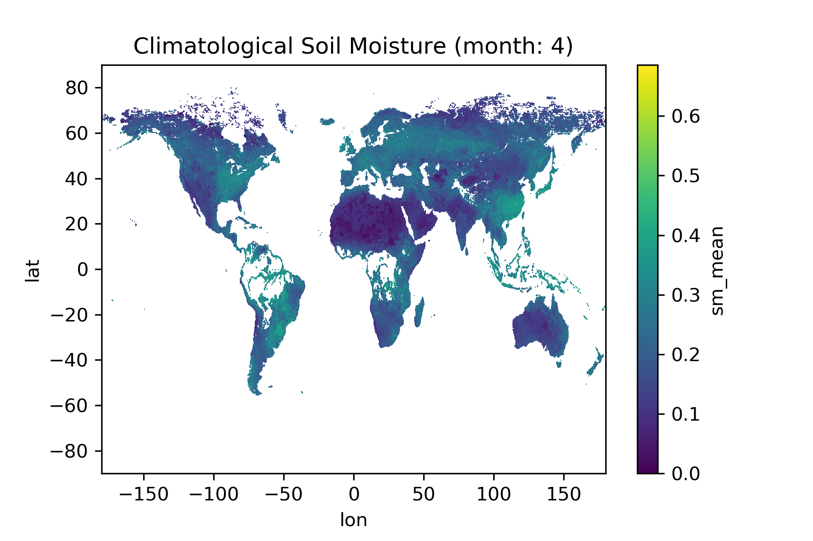

Processing
============

Priors are provided for the respective forward operators. The relationships are shown in following figure:

.. figure:: img/prior_forward.png
   :alt: prior to forward operator relationship

   Figure 1: Relationship of priors to their respective forward operators.

Description of Processing
--------------------------
This prototype is capable of delivering for both vegetation priors as well as soil priors spanning all variables required in the forward operators. The overall processing chain is divided up to two parts (dealing with the soil prior and the vegetation prior).

The optical prior engine is designed to deliver prior information to the inference engine specifically for the leaves and vegetation. The overall flow of the prior-engine is illustrated by Figure 2.

The 'microwave' prior engine is designed to deliver prior information for soil parameters. The overall flow of this part of the prior-engine is illustrated by Figure 3.

In these flowcharts a distinction is made between the current implementation of the prototype (green) and the final foreseen version of the prior engine (red).
In order for completeness a place-holder (orange) process is embedded into the flowchart. In addition, in the final version of the prior engine the users themselves can choose between how the specific prior are used (see `Usage <Usage.rst>`_). User-selections are obtained from the configuration-file with which the MULTIPLY framework is run. This is represented in the flowchart by orange selection boxes.
Prior data specified by the User is currently not visualized for every prior generator.

Vegetation Priors
++++++++++++++++++
Within the prototype version of the module, the values of the priors are consistent with @peak biomass; no dynamical component is integrated into the prototype module.

.. figure:: img/flow_prior_opt.png
   :alt: flow of 'optical' prior engine

   Figure 2: Flow in 'optical' prior engine

Soil Priors
+++++++++++++

The included priors for soil moisture are currently twofold:

1) a climatological prior based on `ESA CCI SM <https://esa-soilmoisture-cci.org/>`_ data
2) a dynamic prior based on `SMAP <https://smap.jpl.nasa.gov/data/>`_ data

Please see the overall flow of this prior creator sub-engine below:

.. figure:: img/flow_prior_mic.png
   :alt: flow of 'microwave' prior engine

   Figure 3: Flow in 'microwave' prior engine

Climatologic Priors
********************

The climatological priors were calculated once and come with the prior engine package.
There is also a interpolation routine included to allow for smooth inter monthly transitions.

.. figure:: img/clim_point.png
   :alt: Climatology soil moisture (bars) at point-scale with interpolated values (line)

   Figure 4: Climatology soil moisture (bars) at point-scale with interpolated values (line)

   Figure 5: Exemplary climatological soil moisture prior (mean) for April

Dynamic Priors
**************

For the SMAP data based 'dynamic' prior the engine relies on the `MULTIPLY data-access component <https://github.com/multiply-org/data-access>`_ to download the appropriate data sets. These are then converted to be used by the inference engine.
A valid registration on NASA's `Earthdata Service <https://urs.earthdata.nasa.gov/>`_ is necessary.

   "SMAP measurements provide direct sensing of soil moisture in the top 5 cm of the soil column. However, several of the key applications targeted by SMAP require knowledge of root zone soil moisture in the top 1 m of the soil column, which is not directly measured by SMAP. As part of its baseline mission, the SMAP project will produce model-derived value-added Level 4 data products to fill this gap and provide estimates of root zone soil moisture that are informed by and consistent with SMAP surface observations. Such estimates are obtained by merging SMAP observations with estimates from a land surface model in a data assimilation system. The land surface model component of the assimilation system is driven with observations-based meteorological forcing data, including precipitation, which is the most important driver for soil moisture. The model also encapsulates knowledge of key land surface processes, including the vertical transfer of soil moisture between the surface and root zone reservoirs. Finally, the model interpolates and extrapolates SMAP observations in time and in space, producing 3-hourly estimates of soil moisture at a 9 km resolution. The SMAP L4_SM product thus provides a comprehensive and consistent picture of land surface hydrological conditions based on SMAP observations and complementary information from a variety of sources." [#]_

Technical Description
-----------------------

The processing chain in the prior engine is defined in a config file.
For now this looks like:

.. literalinclude:: ../multiply_prior_engine/sample_config_prior.yml

The internal flow and relations can be seen in figure 4.

.. figure:: img/PriorEngine.svg
   :alt: prior engine

   Figure 4: Prior Engine relationships

.. [#] https://smap.jpl.nasa.gov/data/
